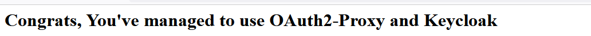

# OAuth2-Proxy Integration with Keycloak and Web Application

An example of how to use OAuth2-Proxy and Keycloak to give authentication capability in any kind of web application. For more information please visit this [blog](https://medium.com/@mrizkysatrio/adding-oauth2-authentication-in-any-web-application-using-oauth2-proxy-and-keycloak-e7887e1d918b)

## Features
- OAuth2-Proxy integrate with KeyCloak


## Usage
- Install docker and docker compose in your environment
- Change the <keycloakIP> value in .env file with the IP Address of your docker host (cannot use 127.0.0.1)
- Go to the folder of the docker compose file and run this command:

```shell
docker compose -f deploy.yaml up
```

- Then open the congrats.html in port 4180 (http://<YOUR HOST IP>:4180/congrats.html)
- You will be redirected to logon page of keyloak. Login using test1/pass123
- If all is good, you will be seeing this page:


## Feedback
For feedback and feature request, please raise issues in the issue section of the repository. Enjoy!!.